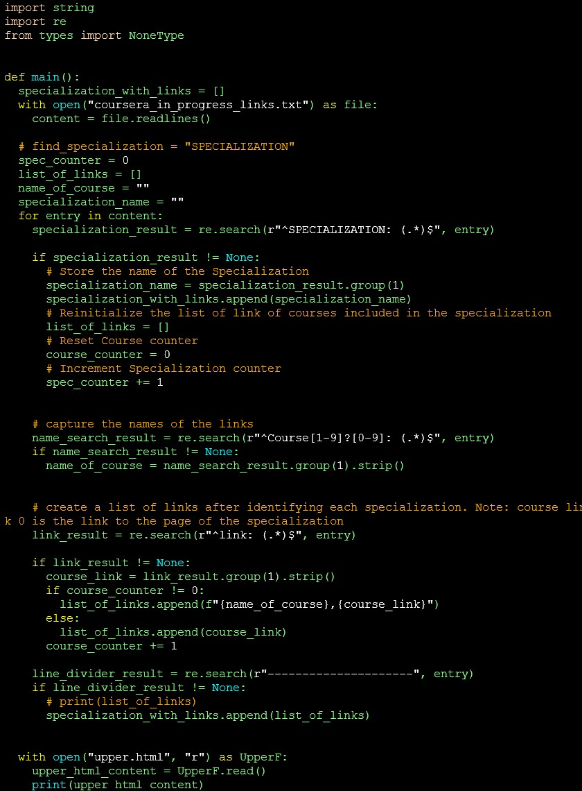
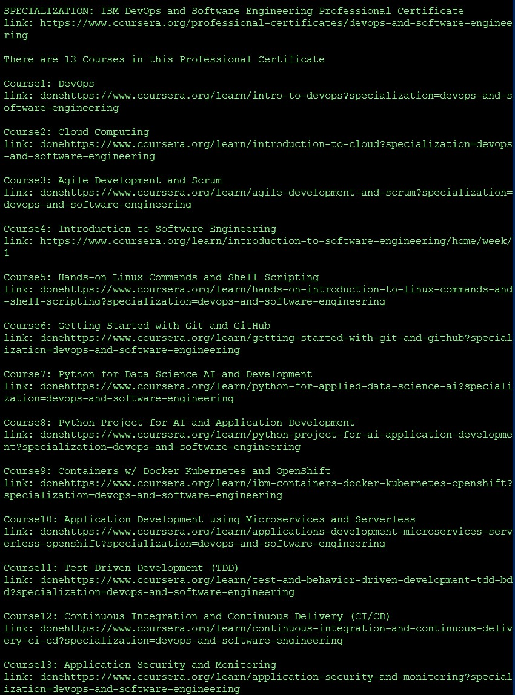

# Coursera Courses Progress Generator/Lister
*This is a Python script that generates a page that shows the progress of my Coursera courses and links to each historical and ongoing courses*

The generated HTML page can be viewed from https://roylouisgarcia.github.io/coursera_course_progress_lister/

### **Code:**

### **Input Text File:**

### Output HTML Page: (https://roylouisgarcia.github.io/coursera_course_progress_lister/)

|  Courses Progress Legend:  |
| :------------------------: |
|    *Dark Green = Done*     |
| *Light Green = Unenrolled* |
|    *Yellow = Enrolled*     |

